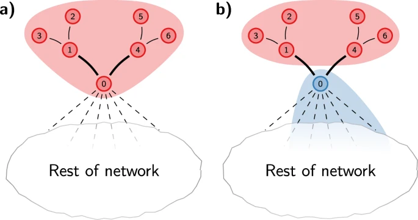

# Graph communities

Group structure in a graph $$G = (V, E)$$ is nowadays called *community structure*, and groups are called *communities* by analogy with social networks since social network analysis is an important branch of network science. We shall also use the terms subgroups or clusters.

When compared with high-dimensional data, finding clusters in a graph differs in that we need to take the link structure into account. Basically, we would like to form groups such that edges mostly connect members *within groups*.

The modularity is a measure attempting to capture how much a community structure $$C_1, C_2, \ldots, C_p \subset V$$ coincides with the graph's natural grouping of nodes into communities.

- We denote $${\bf A} = (A_{i,j})$$ the adjacency matrix of $$G$$ where indices $$i, j$$ correspond to nodes $$i, j \in V$$.
- Let also denote $$k_i$$ the degree of node $$i$$, that is $$k_i = \deg_G(i)$$.
- We write $$c_i$$ for the community to which node $$i$$ belongs. The Kronecker delta $$\delta_{[c_i = c_j]}$$ equals 1 if communities $$c_i$$ an $$c_j$$ coincide, that is if nodes $$i, j$$ belong to the same community.
- Finally, let $$N = |V|$$ equal the number of nodes in $$G$$, while $$m = |E|$$ is its number of edges.

Given a community structure $${\bf C} = (C_1, C_2, \ldots, C_p)$$, we define the modularity of $$G$$ as:

$$Q(G, {\bf C}) = \frac{1}{2m} \sum_{i= 1}^N \sum_{j= 1}^N \big( A_{i,j} - \frac{k_i k_j}{2m} \big) \delta_{[c_i = c_j]}$$

The above expression can be split into community modularity $$Q_C$$ so that $$Q = \sum_C Q_C$$.

$$Q_C  = \frac{1}{2m} \sum_{i} \sum_{j} A_{i,j} \delta_{[c_{i} = c_{j} = C]} - \big( \sum_i \frac{k_i}{2m} \delta_{[c_i = C]} \big)^2 = \frac{\sum_{in}}{2m} - \big(\frac{\sum_{tot}}{2m}\big)^2$$

where $$\sum_{in}$$ is twice the number of edges within community $$C$$ and $$\sum_{tot}$$ is the number of edges incident to nodes in community $$C$$ (even if they connect nodes out of community $$C$$). We also write $$Q_C^{(in)} = \frac{\sum_{in}}{2m}$$ and $$Q_C^{(tot)} = \frac{\sum_{tot}}{2m}$$, so that $$Q_C = Q_{C}^{(in)} - \big( Q_{C}^{(tot)} \big)^2$$.

---

So the problem is turned into an optimization one, that is, we seek to find a community structure maximizing graph modularity.

The Louvain algorithm implements a very simple approach obtaining rather good results (in terms of modulalrity values).

1. First, each node in the network is assigned to its own community.
2. Next, for each node $$i$$, the change in modularity is calculated for removing $$i$$ from its own community and moving it into the community of each neighbor $$j$$ of $$i$$. This value is computed in two steps:
  - Compute the change in modularity $$\Delta Q$$ for removing node $$i$$ from its original community.
  - Compute the change in modularity $$\Delta Q$$ for inserting an isolated node $$i$$ (i.e. node $$i$$ has no connections and is in a community of only itself) into the community of neighbouring node, denoted  $$c_{j}$$.
3. Node $$i$$ is then moved in the community for which the modularity increase is maximum. If no increase is possible, node $$i$$ remains in its original community.
4. The process is repeated until no modularity increase occurs.

---

**Exercise 1**. Show that the modularity of a community containing a single node $$i$$ is equal to $$Q_{\{i\}} = - (\frac{k_i}{2m})^2$$.

Write down the modularity of community $$c_j$$ containing node $$j$$ as

$$Q_{c_j} = \frac{1}{2m} \sum_{\mu = 1}^{N_j} \sum_{\nu = 1}^{N_j} A_{\mu, \nu} - \big( \sum_{\mu=1}^{N_j} \frac{k_\mu}{2m} \big)^2$$

where it is understood that community $$c_j$$ has $$N_j$$ nodes indexed from 1 to $$N_j$$.

---

**Exercise 2**. Show that the modularity of community $$c' = c_j \cup \{i\}$$ obtained by adding node $$i$$ to community $$c_j$$ is equal to:

$$\frac{1}{2m} \big( \sum_{\mu = 1}^{N_j} \sum_{\nu = 1}^{N_j} A_{\mu, \nu} + 2 k_i^{(j)} \big) - \big( \frac{\sum_{\mu=1}^{N_j} k_\mu + k_i}{2m} \big)^2$$

where $$k_i^{(j)}$$ denotes the number of edges incident to $$i$$ and a node in community $$c_j$$. That is, $$Q_{c_j \cup \{i\}}^{(in)} = Q_{c_j}^{(in)} + \frac{k_i^{(j)}}{m}$$ and $$Q_{c_j \cup \{i\}}^{(tot)} = Q_{c_j}^{(tot)} + \frac{k_i}{2m}$$.

Consequently, the gain from moving node $$i$$ into community $$c_j$$ results in:

$$\Delta Q^{\cup \{i\}} = Q_{c_j \cup \{i\}} - Q_{c_j} - Q_{\{i\}}$$

---

**Exercise 3**. Similarly, compute the gain in modularity by moving node $$i$$ out of its community $$\Delta Q^{- \{i\}} = Q_{c_i - \{i\}} - Q_{c_i} + Q_{\{i\}}$$.

---

The total gain when moving node $$i$$ out of its community and into community $$c_j$$ is thus equal to $$\Delta Q = \Delta Q^{\cup \{i\}} + \Delta Q^{- \{i\}} = Q_{c_j \cup \{i\}} + Q_{c_i - \{i\}} - Q_{c_i} - Q_{c_j}$$.

By properly keeping a number of values, computing $$\Delta Q$$ can be obtained readily, making the Louvain algorithm one of the fastest community detection algorithm.

- Recall our notations $$Q_{C}^{(in)} = \frac{\sum_{in}}{2m} = \frac{1}{2m} \sum_{\mu = 1}^{N_C} \sum_{\nu = 1}^{N_C} A_{\mu, \nu}$$ and $$Q_{C}^{(tot)} = \frac{\sum_{tot}}{2m} = \sum_{\mu=1}^{N_C} \frac{k_\mu}{2m}$$, so that $$Q_C = Q_{C}^{(in)} - \big( Q_{C}^{(tot)} \big)^2$$
- Hence, referring to the notations above, we have $$Q_{c'}^{(in)} = Q_c^{(in)} + \frac{k_i^{(j)}}{m}$$ and $$Q_{c'}^{(tot)} = Q_c^{(tot)} + \frac{k_i}{2m}$$

**Exercise 4**. Write similar expressions for $$Q_{c_i - \{i\}}^{(in)}$$ and $$Q_{c_i - \{i\}}^{(tot)}$$.

| Communities |       | $$C_1$$ | $$C_2$$ | ... | $$C_k$$ |  $$\sum$$ |
|-------------|-------|---------|---------|-----|---------|---------------|
| **Nodes**   | $$i$$ | $$k_i^{(1)}$$ | $$k_i^{(2)}$$ | ... | $$k_i^{(p)}$$ | $$k_i = \sum_\mu k_i^{(\mu)}$$ |
| $$\vdots$$  | ...   | ...           | ...           | ... | ... | |
| $$\vdots$$  | $$j$$ | $$k_j^{(1)}$$ | $$k_j^{(2)}$$ | ... | $$k_j^{(p)}$$ | $$k_j  = \sum_\mu k_j^{(\mu)}$$ |
| $$Q_{communitites}$$ | $$Q_{C_1}^{(in)}, Q_{C_1}^{(tot)}$$ | $$Q_{C_2}^{(in)}, Q_{C_2}^{(tot)}$$ | ... | ... | $$Q_{C_p}^{(in)}, Q_{C_p}^{(tot)}$$ | |

---

One drawback of the Louvain algorithm, as it is implemented, is it can disconnect a community when migrating a node to another community as shows the figure (moving node 0 from the red community a) to the blue community b) results in disconnecting the red community). The Leiden algorithm prevents this from happening.

## Bibliographical references

- [This page is inspired from the Network Science series on Wikipedia](https://en.wikipedia.org/wiki/Louvain_method).
- Traag, V.A., Waltman, L. & van Eck, N.J. From Louvain to Leiden: guaranteeing well-connected communities. Nature Scientific Reports 9, 5233 (2019). [DOI 10.1038/s41598-019-41695-z](https://doi.org/10.1038/s41598-019-41695-z)