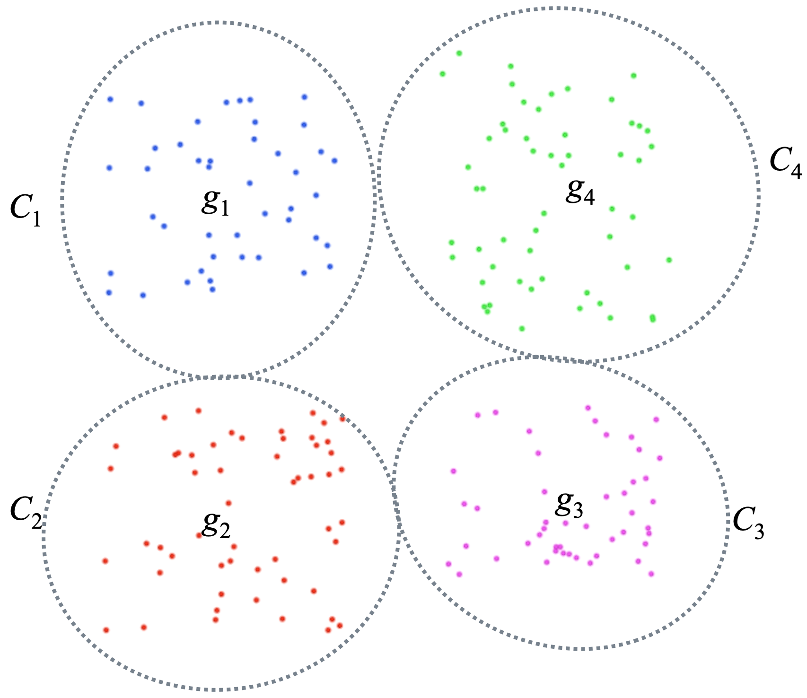

# $$k$$-means clustering

A widely known, and still widely used algorithm is the $$k$$-mea,s algorithm based on the idea that points $$x \in D$$ belonging to a same cluster $$C \subset D$$ should be close to one another.

The $$k$$ part of the algorithm is the number of clusters that needs to be set although unknown. We'll come back to the choice of $$k$$ later.

- For now, let's assume $$k$$ is given.
- We first randomly select $$k$$ points $$g_1, g_2, \ldots, g_k \in D$$ and imagine they correspond to the barycenters of $$k$$ clusters $$C_1, C_2, \ldots, C_k$$.
- We then iterate *until barycenters* $$g_1, g_2, \ldots, g_k \in D$$ "*stabilize*"
  - for each point $$x \in D$$ we assign it to group $$C_i$$ if $$g_i$$ is closest to $$x$$ among all barycenters.
  - Having done so, we now update barycenters $$g_i = \sum_{C_i} w_x x$$.

The algorithm stops when barycenters are stable, meaning that points are always assigned to a same cluster (except maye for marginal cases where points may oscillate between two neighboring barycenters).

**Finding a proper** $$k$$. Given $$k$$, the algorithm will compute precisely $$k$$ clusters, which may not correspond to a "natural" grouping of points.

That is, if $$D$$ admits a proper value for $$k$$, then a clustering using these $$k$$ groups should be one with maximum inter-cluster  inertia $$I_{inter}$$, or equivalently minimum intra-cluster inertia $$\sum_C (w_C \cdot I_C)$$.

Hence, we may form the curve where $$k$$ is the independent variable and inertia (intra or inter) is the dependent variable. A value $$k$$ for which the curve shows the steepest change in slope usually is a good indicator for a proper value of $$k$$.

For example, when applying $$k$$-means to a grid of points (points sitting at integer coordinates in the 2d plane.