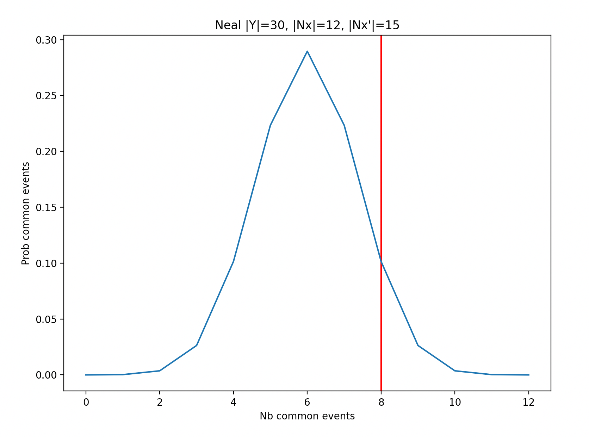

# Graph projections

Interaction between two entities $$x, x' \in X$$, be they persons or proteins, sometimes cannot be observed directly. Instead, some third party entity $$y \in Y$$ or fact will be used to induce interaction between $$x$$ and $$x'$$.

Examples are:

- *People* ($$x, x' \in X$$) who participate to different **events** ($$y \in Y$$)
- *Organizations* (companies, research laboratories) who participate to research or R&D **projects**
- Etc.

The graphs used to model these situations are bipartite: they comprise nodes or two different types $$X$$ or $$Y$$, and links necessarily connect nodes of different types.

These graphs can be studied *per se*. For instance, one can prove that a graph is bipartie exactly when (iif $$\Leftrightarrow$$) it does not contian any cycle of odd length.

**Exercise**. Come up with a proof of this fact. $$\square$$

Some authors have moreover claim that most social networks (or more precisely, Complex Networks)) take their origin in bipartite graphs.

Guillaume, J. L., & Latapy, M. (2006). *Bipartite graphs as models of complex networks*. Physica A: Statistical Mechanics and its Applications, 371(2), 795-813.

## One-mode projection

Although giving a more accurate account of the data, bipartite graphs do not allow to readily use node centralities in order analyse the data at hand. Indeed, in a social network, the degree of a node indicates how many persons a given actor knows, while in a bipartite graphs we'd need to look at distance 2 neighbors. The situation is even more complex when considering length of paths connecting actors.

**Exercise**. The [SoutherWomen.xml](./SoutherWomen.xml) file contains the description of a network connecting women to events they participates to. This is a widely known dataset i social sciences and network science as well.

1. What is the average number of participants in an event?
2. To how many events does a woman participate on average?

These exercises are designed to make you aware of the difficulties inherent in the bipartite nature of the graph.

The [following script](./SouthernWomen.py) reads the XML file and outputs a Tulip graph including node labels and icons.
$$\square$$

A network solely containing entities of the same type can be derived form the original bipartite graph. This derived network is called a *one-mode projection* since it amounts to build a new graph $$G = (V, E)$$ (where $$V = X$$ for instance) induce any length two path connecting $$x - y - x'$$ to a single edge $$\{x, x'\} \in E$$.

**Exercise**. A clique over a set of nodes $$C$$ is a graph where all pairs of nodes $$x, x' \in C$$ are connected. (Hence a clique contains $$\frac{|C| \cdot (|C|-1)}{2}$$ edges.)

Let $$H$$ be a bipartite graph over nodes $$X \oplus Y$$ and $$G = (X, E)$$ be the one-mode projection on $$X$$ obtained from $$H$$. Let $$C \subset X$$ be the nodes incident to a given node $$y \in Y$$ in $$H$$. Then the clique over $$C$$ is a subgraph of $$G$$. $$\square$$

Hence a one-mode projection of a graph being a collection of cliques will typically be dense: that is, its number of edges compared to its number of nodes $$\frac{|E}{|V|}$$can be quite large. 

More precisely,

- considering that a graph having a number of edges $$|E| = 4|V|$$ is hardly readable (using any layout algorithm), 
- considering one-mode projection graph consist of a collection of cliques, and consequently can locally have a quadratic number of edges (in terms of node size)

we see that one-mode projection can be hard to analyze, if not visualize.

**Exercise**. Write a python script to compute the one-mode projection of the Southern Women dataset. $$\square$$

### Filtering edges using weights

When projecting length 2 paths in $$H$$ onto edges in $$G = (V, E)$$, we may naturally assign edges $$e \in E$$ a weight corresponding to the number of different paths $$x - y - x'$$ leading to $$e = \{x, x'\}$$. That is, this number is equal to the *number of common neighbors* $$x$$ and $$x'$$ have in $$H$$ (number of events/projects people/organizations co-participate into, e.g.).

One may then consider this weight to filter out edges of a lesser weight, leading to a subgraph of lower edge density.

#### Giatsidis weighting scheme

Giatsidis came up with a scheme to weight edges of the one-mode projection:

- Length 2 paths $$x - y - x'$$ do not contribute the same weight depending on the degree of node $$y$$.
 
Giatsidis *et al.* (2011) *Evaluating Cooperation in Communities with the k-Core Structure*. Advances in Social Networks Analysis and Mining (ASONAM), 87-93.

Recall that node $$y$$ is a common neighbor of nodes $$x$$ and $$x'$$, that is $$y \in N(x) \cap N(x')$$. The weight of the edge connecting nodes $$x$$ and $$x'$$ is equal to:

$$\sum_{y \in N(x) \cap N(x')} \frac{1}{\deg(y)}$$

Just as if being connected to a lower degree common neighbor is more significant.

**Exercise**.

- Considering the classical weighted one-mode graphe computed from the Southern Women dataset, what is the threshold that leads to filtering out half of the lower weight edges?
- Considering the Giatsidis weighted one-mode graphe computed from the Southern Women dataset, what is the threshold that leads to filtering out 75% of the lower weight edges?

$$\square$$

#### Zachary Neal's weighting scheme

Zachary Neal came up with another approach based on the idea that only less probable connection -- hence more "intentional" --  should induce an edge in the one-mode graph. That is, if nodes $$x$$ and $$x'$$ both have a high degree, the probability that they have a common neighbor $$y$$ is high, hence the edge connecting them should have a lower weight.

Neal, Z. (2013). *Identifying statistically significant edges in one-mode projections*. Social Network Analysis and Mining, 3, 915-924.

Neal suggests looking at the probability distribution of the number of common neighbors nodes $$x, x'$$ might have, and decide whether the actual number of common neighbor is actually significant or could just be pure luck.

That is, given nodes $$x, x'$$ respectively have degree $$d, d'$$, we may compute the probability that they have $$k$$ neighbors in common. Let $$X \oplus Y$$ be the set of nodes of the bipartite graph. We have:

$$P(|N(x) \cap N(x')| = k) = \frac{{|Y| \choose k}{|Y| - k \choose \deg (x) - k}{|Y|-\deg(x) \choose \deg(x') - k}}{{|Y| \choose \deg(x)}{|Y| \choose \deg(x')}}$$

We then may compute the value of $$k$$ for which $$P(|N(x) \cap N(x')| \geq k) \leq \alpha$$ for some threshold $$\alpha$$ (usually $$\alpha = 0.05$$), and only infer an edge between $$x$$ and $$x'$$ when $$|N(x) \cap N(x')| \geq k$$.

The figure illustrates the probability distribution when $$|Y|=30$$, $$|N(x)|=12$$ and $$|N(x')|=15$$. In this case, is appplying a threshold of $$\alpha = 0.05$$, the minimum number of events $$x, x'$$ must have in common to be significant is 8.

**Exercise**. Starting form the Southern Women bipartite graph, compute the Neal projection scheme to with confidence threshold $$\alpha = 0.05$$ to obtain a one-mode graph between women nodes.

**Exercise**. Applying the Neal projection scheme with $$\alpha = 0.05$$ confidence,

- among all pairs of connected nodes (edge between any two women) which connects women having co-participated to the largest number of events?
- is the most central woman (*w.r.t.* betweenness centrality) one that has participated to the largest number of events?

$$\square$$

## Filtering out edges from dense graphs

Hence, we see a major challenge when dealing with one-mode projection is edge density. Now, the problem of discarding edges in order to gain ledgebility is an important problem in itself thata can be of particular use with one-mode projection.

Many authors have addressed the problem of extracting "the" backbone structure of a graph, that is only keepingn edges that will preserve centralities.

Nick et al. (2013). *Simmelian backbones: Amplifying hidden homophily in facebook networks*. 2013 IEEE/ACM international conference on advances in social networks analysis and mining (pp. 525-532).

In their paper, Nick *et al*. came up with an elegant rationale promoting triads (cycles of length 3) as being core to the structure of a social network. Hence edges that are included in more triads are considered as constituants of the backbone.

So a first statistics they compute assigns edges in a graph the number of triads they are included in. Note that this amounts to computing the number of common neighbor their incident nodes have. This, in a sense, computes the *strength* of an edge.
Hence, edges $$I^{(u)} = e_1, e_2, \ldots$$ incident to a node $$u$$ can be sorted in decreasing order with respect to their strength. Hence edge $$e_1$$ is the strongest, followed by $$e_2$$, and so on ...

Note that, there may be cases where the strength of edges is given by a specific attributes, in which case it does not need to be computed.

Observe that a triad containing an edge $$e = \{u, v\}$$ necessarily also contains an edge in $$I^{(u)}$$ and another in $$I^{(v)}$$. Denote by $$I^{(u)}|_k$$ the subset consisting of the $$k$$ strongest edges in $$I^{(u)}$$.

Nick et al. introduce what they call *edge redundance* denoted as $$R_k(e)$$, which depends on some parameter $$k$$, and equals the number of triads formed by $$e = \{u, v\}$$ and edges in $$I^{(u)}|_k$$ and $$I^{(v)}|_k$$.

When $$k$$ is not specified, Nick et al. suggest to take the value $$k$$ for which $$R_k(e)$$ is maximum.

**Exercise**. Use the [Facebook data](./Facebook.tlp) Nick et al. originally used in their paper and compute a backbone structure for this graph. The color attribute of nodes relate to students belonging to student communities. It is expected that the backbone reflects membership to their communities (clusters should group a majority of nodes with a same color).

Discuss the use of parameter $$k$$. $$\square$$

